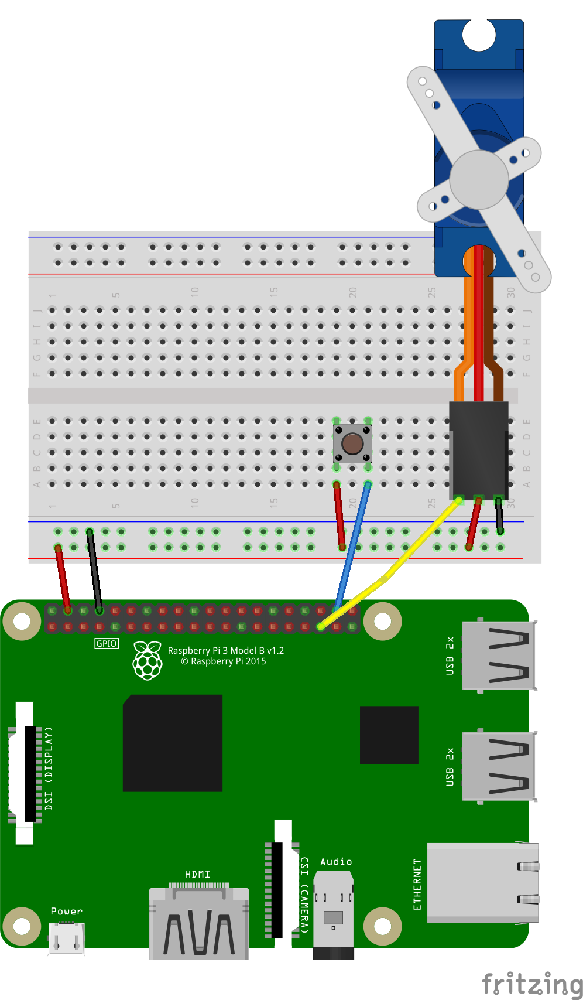

# NAG-IoT
## Návrat

1. Servo
	- Úhel natočení serva se dá nastavit pomocí PWM výstupu na GPIO pinu, kdy při periodě 20ms nastavíme horní hodnotu pulzu na začátku mezi 1-2ms, na toto jsme si napsali vlastní knihovnu jenž řeší přepočet mezi stupňema a nastaví PWM na příslušnou hodnotu.

2. Implementace s tlačítkem
	- Logika obvodu s tlačítkem nebude moc složitá, stačí opět udělat nekonečnou `while: True` smyčku s nějakým debouncem (`time.sleep(0.05)`) kde se nastaví úhel serva na 0 stupňů. Zároveň kontrolujeme na stisk tlačítka, pokud je tlačítko stisknuto stačí závoru otevřít (nastavit úhel serva na 90 stupňů) a zmrazit program na 10 sekund.

### Schema zapojení

- Konečné schema zapojení na které funguje náš testovací zdrojový kod

