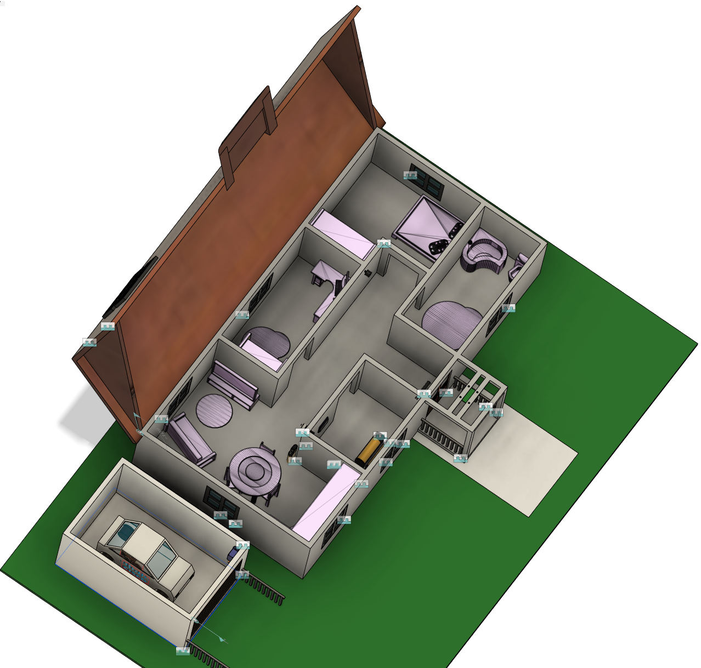

# NAG-IoT
## -Návrat-

Tuto soutěž jsme pojali ve velkém a děláme plnohodnotně funkční model domu ze dřeva.
Model je momentálně v rozpracovaném stavu kdy máme navrhnutý model domu, ten vymodelovaný, zdi vyfrézovány a slepeny.  
V budoucnu nás čeká naplánování položení kabeláže pro napájecí obvod a jednotlivé datové linky.

### hrubý náčrt

### rozmístění senzorů

### nákres domu

### stavba domu
--- fotky