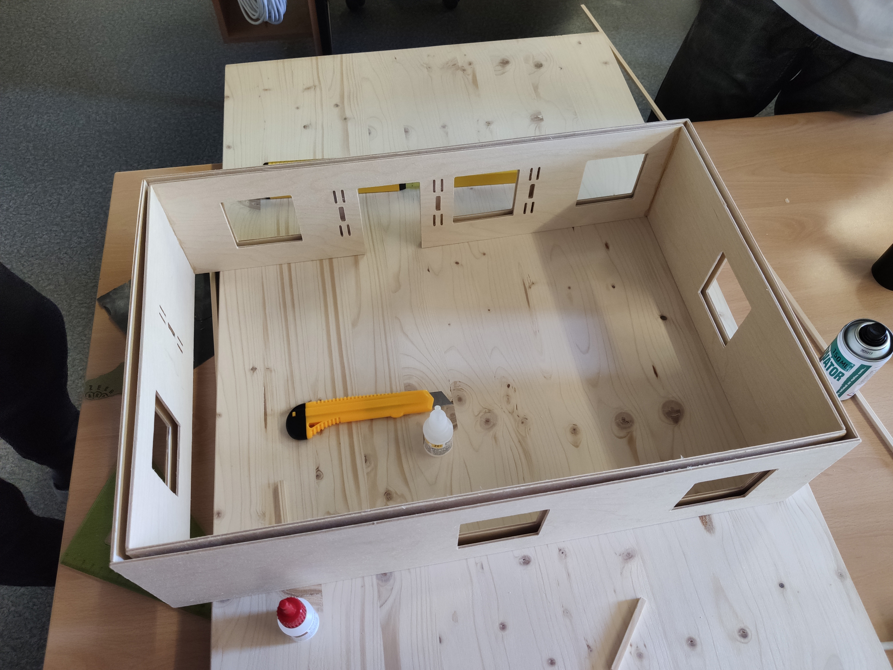

# NAG-IoT
## -Návrat-

Tuto soutěž jsme pojali ve velkém a děláme plnohodnotně funkční model domu ze dřeva.
Model je momentálně v rozpracovaném stavu kdy máme navrhnutý model domu, ten vymodelovaný, zdi vyfrézovány a slepeny.  
V budoucnu nás čeká: dodělání (výroba,lepení) vnitřních zdí, naplánování položení kabeláže pro napájecí obvod a jednotlivé datové linky k senzorům.

### Hrubý náčrt
Nejdříve jsme celý model domu promysleli předem a udělali prvotní návrh, ze kterého budeme dále vycházet.

### Rozmístění senzorů
Rozkleslili jsme si celý interiér a promysleli jsme, kam dáme jaké senzory, abychom využili maximum místa, schovali kabely do zdí a zároveň využili plnou funkci těchto senzorů.

### Nákres domu
Celž model jsme vymodelovali v CAD programu Fusion360 dle našich ideálních představ, střecha na pantu, rozmístěný 3D tištěný nábytek, pár senzorů pro demonstraci a do budoucna i garáž.

Pohled do vnitřku našeho domu.

### Výroba modelu
Ze zdí modelu jsem si vytáhli křivky a vyfrézovali na CNC fréze z překližky.

### Stavba domu
Sehnali jsme dřevěnou desku, která bude fungovat jako pevný základ celého domu. Na té jsme začali vše stavět.

